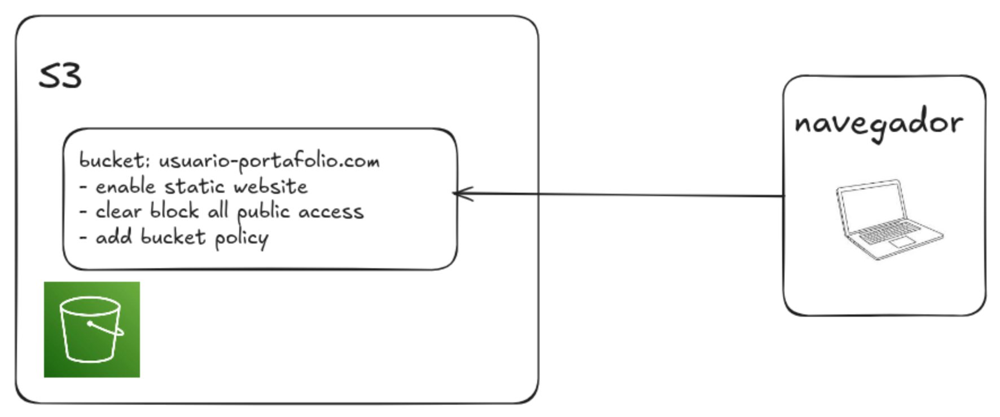

# StaticWebsite

Para la creación de sitios web estáticos podemos utilizar el servicio de AWS S3
y configurarlo para permitir que cualquier persona vea nuestra página web.

## Requisitos

- Tener una cuenta de AWS o acceso al sandbox de AWS academy
- Tener AWS CLI instalado

## Descripción

En este demo se muestran dos sitios web estáticos
`mi-website`: es una página web sencilla para demostrar el flujo de trabajo
`mi-portafolio`: es un portafolio más complicado utilizando el framework Hugo

Cualquier proyecto de página web estática puede cargarse a un bucket de S3.

Para poder almacenar un sitio web es necesario crear un bucket en S3 con una
configuración específica:
- habilitar `Alojamiento de sitios web estáticos`
- deshabilitar los bloqueos en `Bloquear acceso público`
- agregar una política a `Política de bucket`

Los pasos están descritos en el siguiente tutorial de AWS [Tutorial: Configuring a static website on Amazon S3](https://docs.aws.amazon.com/AmazonS3/latest/userguide/HostingWebsiteOnS3Setup.html)

## Diagrama del sistema

Ambos proyectos siguen la siguiente mini arquitectura.

